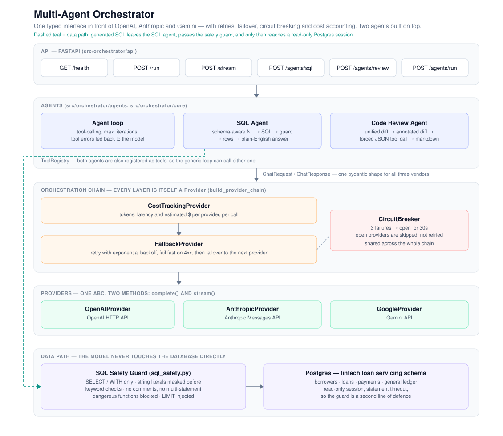

# Multi-Agent Orchestrator

**Live API: https://REPLACE-ME.up.railway.app** · [health](https://REPLACE-ME.up.railway.app/health) · [interactive docs](https://REPLACE-ME.up.railway.app/docs) · [current limits](https://REPLACE-ME.up.railway.app/limits)

<!-- TODO: replace REPLACE-ME above with the real Railway subdomain once the service is deployed. -->

```bash
curl -s https://REPLACE-ME.up.railway.app/agents/sql \
  -H 'content-type: application/json' \
  -d '{"question": "How many loans are currently delinquent?"}'
```

A provider-agnostic LLM orchestration layer with automatic failover, plus two agents built on
top of it: a natural-language-to-SQL agent over a fintech loan servicing database, and a code
review agent that turns a pull request diff into structured review comments.

One integration surface. Three providers. If OpenAI is down, the same request completes on
Anthropic or Gemini without the caller knowing.

## Why it exists

Most LLM application code is written directly against one vendor SDK. That is fine until the
vendor rate-limits you, changes a response shape, or prices you out. This project puts a single
typed interface in front of OpenAI, Anthropic and Gemini, and handles the operational concerns
that show up in production: retries, failover, circuit breaking, cost accounting, spend caps,
and safety guards on anything the model generates that is about to be executed.

## Architecture



Every provider implements the same two methods, `complete()` and `stream()`, and every wrapper
in the chain is itself a `Provider`. That is what makes the chain composable: the spend cap
wraps cost tracking wraps failover wraps the real SDK calls, and the agent loop only ever sees
a `Provider`.

```
SpendCapProvider -> CostTrackingProvider -> FallbackProvider -> CircuitBreaker -> vendor SDK
```

## Layout

```
src/orchestrator/
  providers/     base Provider ABC, one implementation per vendor, fallback + chain builder
  core/          agent loop, tool registry, circuit breaker, cost tracker, spend cap, models
  agents/        SQL agent, code review agent, diff parser, SQL safety guard, tool wrappers
  api/           FastAPI app, request/response schemas, rate limiting
  db/            fintech schema, seed script, read-only connection helper
tests/           unit and API tests, fakes in tests/helpers.py
scripts/         runnable demos
```

## Endpoints

| Method | Path             | What it does                                                |
| ------ | ---------------- | ----------------------------------------------------------- |
| GET    | `/health`        | Liveness probe                                               |
| GET    | `/limits`        | Rate limit, auth requirement, and remaining demo budget      |
| POST   | `/run`           | One completion through the provider chain                    |
| POST   | `/stream`        | The same, streamed as server-sent events                     |
| POST   | `/agents/sql`    | Question -> SQL -> rows -> plain-English answer              |
| POST   | `/agents/review` | Unified diff -> structured review comments plus markdown     |
| POST   | `/agents/run`    | The tool-calling agent loop with both agents registered      |

## Running the demo without it running up a bill

The hosted URL is public and unauthenticated, which means anything that reaches a provider is
spending real credits. Two independent guards sit in front of that, because a rate limit alone
caps request volume rather than cost, and a spend cap alone still lets one client monopolise the
budget.

**Rate limit** — a per-IP sliding window on every endpoint that can reach a provider
(`/health` is deliberately exempt so platform health checks are never throttled). Over the
limit returns `429` with `Retry-After`; allowed responses carry `X-RateLimit-Remaining`.
`X-Forwarded-For` is honoured so the limit applies to the real caller rather than the proxy.

**Spend cap** — `SpendCapProvider` sits at the top of the provider chain and refuses the call
before it reaches a vendor once the window's budget is spent, returning `402` with the time
until reset. It reuses the pricing table the cost tracker already maintains, and streamed
responses are charged an estimate from character counts rather than being free. The counter is
in-process and resets on redeploy: no external state for a single-instance demo, and a restart
can only reset a budget that was capped anyway.

**Optional API key** — setting `API_KEY` closes the demo entirely; metered endpoints then
require a matching `X-API-Key` header. Leaving it unset keeps the demo open but limited.

```bash
curl -s https://REPLACE-ME.up.railway.app/limits
{"rate_limit":{"requests":10,"window_seconds":60},"auth_required":false,
 "spend_cap":{"cap_usd":5.0,"spent_usd":0.42,"remaining_usd":4.58,"resets_in_seconds":51843}}
```

## SQL safety

The model is never trusted with database access. Every generated statement passes through
`agents/sql_safety.py` before it reaches Postgres:

- only `SELECT` and `WITH` may lead the statement
- write and DDL keywords are rejected, checked after string literals are masked so a borrower
  named `'O''Brien'` or a status of `'update'` does not trip the guard
- SQL comments, dollar-quoted blocks, and multiple statements are rejected outright
- dangerous functions such as `pg_read_file` and `pg_sleep` are blocked
- a `LIMIT` is injected when the query does not have one
- the connection itself is opened read-only with a statement timeout, so the guard is a second
  line of defence rather than the only one

## Running it locally

```bash
uv sync
cp .env.example .env          # then fill in your API keys

docker compose up -d postgres
uv run python -m orchestrator.db.seed

uv run uvicorn orchestrator.api.app:app --reload
```

Or run the whole thing, API and database together:

```bash
docker compose up --build
```

## Demos

```bash
uv run python scripts/demo_sql_agent.py
uv run python scripts/demo_sql_agent.py "Which borrowers have more than one loan?"
uv run python scripts/demo_code_review.py --git main...HEAD
uv run python scripts/demo_agent.py
```

## Tests

```bash
uv run pytest
```

The suite runs entirely offline. `tests/helpers.py` provides a scripted fake provider and a fake
database connection, so failover, circuit breaking, cost accounting, rate limiting, the spend
cap, SQL safety, diff parsing and every API route are covered without a network call or a live
database. The rate limiter and spend cap both take an injectable clock, so the window tests are
deterministic rather than sleeping.

## Deploying

The image is a plain Dockerfile, so anything that builds Dockerfiles works. `railway.json` is
committed for Railway: connect the repo, set `OPENAI_API_KEY`, `ANTHROPIC_API_KEY` and
`GEMINI_API_KEY`, and it builds from the Dockerfile and health checks `/health`.

The database is deliberately not tied to the host. Set `DATABASE_URL` to any Postgres
connection string - a hosted Neon or Supabase instance, a Railway plugin, anything - and run
the seed script once against it:

```bash
DATABASE_URL='postgresql://...' uv run python -m orchestrator.db.seed
```

The container binds `0.0.0.0` on the injected `PORT`, so it works unchanged on any platform that
assigns a port at runtime.

## Configuration

`DATABASE_URL` wins if it is set; the individual `POSTGRES_*` variables are the local fallback.

| Variable                        | Default          | Purpose                               |
| ------------------------------- | ---------------- | ------------------------------------- |
| `OPENAI_API_KEY`                | -                | OpenAI provider                       |
| `ANTHROPIC_API_KEY`             | -                | Anthropic provider                    |
| `GEMINI_API_KEY`                | -                | Gemini provider                       |
| `SPEND_CAP_USD`                 | `5.00`           | Budget per window; `0` or `off` disables it |
| `SPEND_CAP_WINDOW_SECONDS`      | `86400`          | How often the budget resets           |
| `RATE_LIMIT_REQUESTS`           | `10`             | Requests per client per window        |
| `RATE_LIMIT_WINDOW_SECONDS`     | `60`             | Rate limit window                     |
| `API_KEY`                       | -                | If set, metered endpoints require `X-API-Key` |
| `DATABASE_URL`                  | -                | Full Postgres connection string       |
| `POSTGRES_HOST`                 | auto-detected    | SQL agent database host               |
| `POSTGRES_PORT`                 | `55432`          | SQL agent database port               |
| `POSTGRES_USER`                 | `admin`          | SQL agent database user               |
| `POSTGRES_PASSWORD`             | `password`       | SQL agent database password           |
| `POSTGRES_DB`                   | `loan_bank_db`   | SQL agent database name               |
| `POSTGRES_STATEMENT_TIMEOUT_MS` | `10000`          | Kills runaway generated SQL           |
| `PORT`                          | `8000`           | HTTP port                             |
